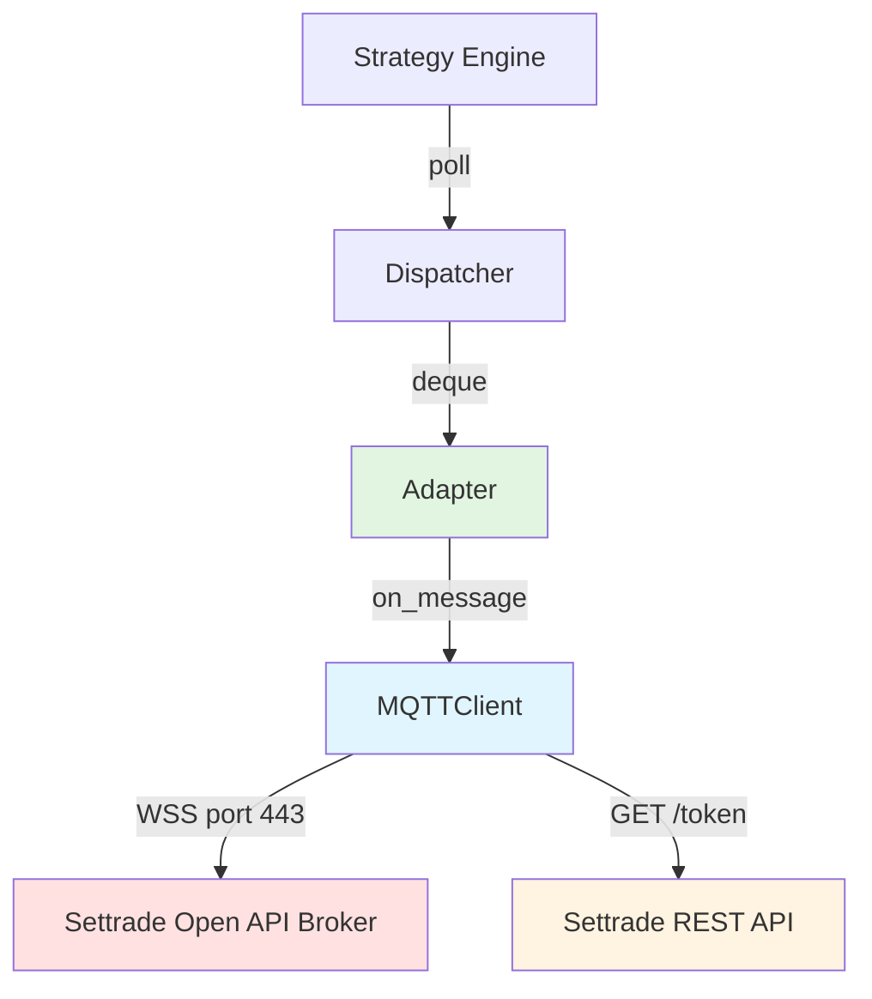
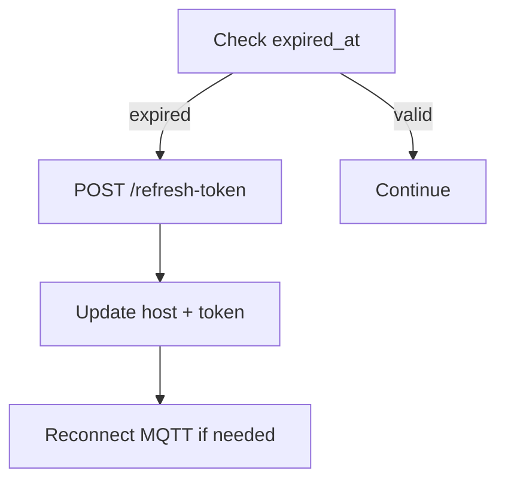
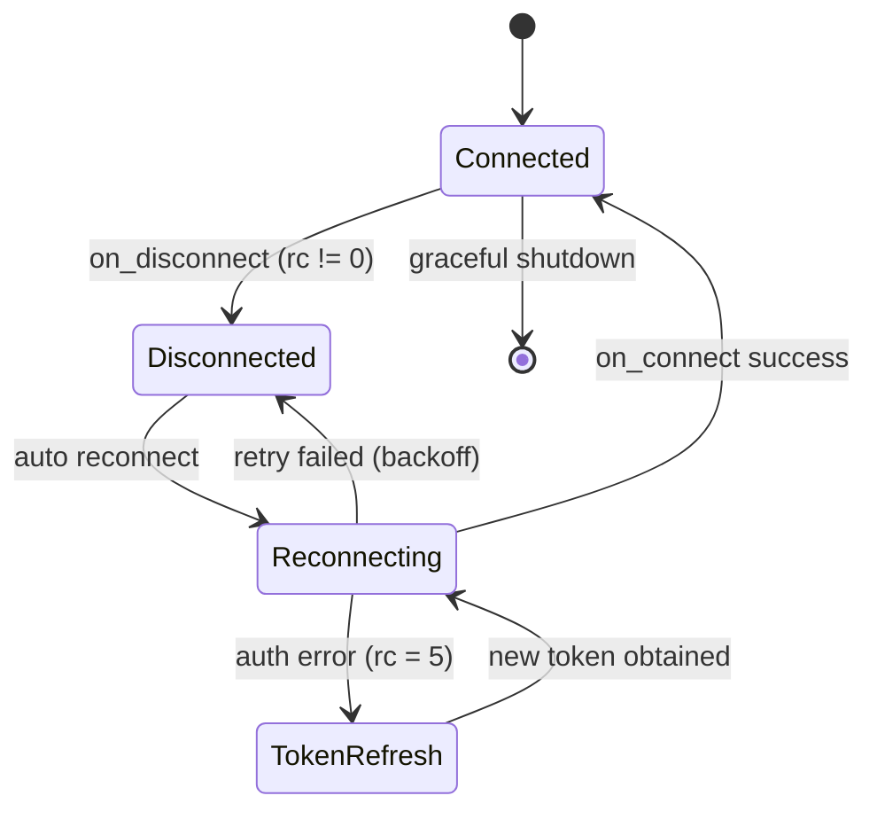

# Settrade MQTT Feed Adapter Implementation Plan

**Feature:** Market Data Ingestion Layer for Settrade Open API
**Branch:** `feature/mqtt-feed-adapter`
**Created:** 2026-02-12
**Status:** In Progress (Phase 4 Complete, Phase 5 Specified)
**Positioning:** Production-aware ingestion layer with architectural control

---

## Table of Contents

1. [Overview](#overview)
2. [Performance & Reliability Requirements](#performance--reliability-requirements)
3. [Concurrency Model](#concurrency-model)
4. [Runtime Considerations](#runtime-considerations)
5. [Architecture](#architecture)
6. [Service Logic Flow](#service-logic-flow)
7. [Failure Handling Strategy](#failure-handling-strategy)
8. [Implementation Phases](#implementation-phases)
9. [Data Models](#data-models)
10. [Protocol Versioning](#protocol-versioning)
11. [Latency Measurement](#latency-measurement)
12. [Backpressure Strategy](#backpressure-strategy)
13. [Observability](#observability)
14. [Integration Examples](#integration-examples)
15. [Testing Strategy](#testing-strategy)
16. [Success Criteria](#success-criteria)
17. [Future Enhancements](#future-enhancements)
18. [Commit & PR Templates](#commit--pr-templates)

---

## Overview

### Purpose

This feature implements a **market data ingestion layer** that connects directly to the Settrade Open API real-time data MQTT service, providing explicit control over the full data pipeline from MQTT → Protobuf → Typed Events. This is an infrastructure foundation for developers who need control, observability, and deterministic flow rather than the convenience of the official SDK's abstracted approach.

### Design Rationale

The official SDK (`settrade_v2.realtime`) is production-ready and convenient for most use cases. However, it makes specific implementation choices that prioritize convenience over control:

| Implementation Choice | Official SDK | This Adapter | Trade-off |
|---|---|---|---|
| Callback execution | `threading.Thread` per message | Inline in MQTT thread | Less overhead, but blocks IO thread |
| Message parsing | `.parse(msg).to_dict(casing=SNAKE)` | `.parse(msg)` + direct field access | Fewer allocations, but less convenient |
| Price representation | `Decimal` for exact arithmetic | `float` via `units + nanos * 1e-9` | Faster, but loses exact decimal precision |
| Event dispatch | Hidden threading | Explicit bounded queue | More control, but more responsibility |
| Backpressure | Implicit (thread pool) | Explicit (drop-oldest) | Predictable, but requires monitoring |

In practice, these differences result in **modest latency improvements (~1.1-1.3x)** for parse + normalize operations. **The primary value is architectural control, not raw speed.**

### Key Objectives

1. **Direct MQTT Connection** – Low-level control over connection, authentication, and reconnection logic
2. **Protobuf Parsing** – Direct field access from protobuf messages (no JSON/dict abstraction layer)
3. **Typed Event Models** – Strongly-typed Pydantic models instead of dynamic dictionaries
4. **Explicit Dispatcher** – Bounded queue with visible backpressure strategy (drop-oldest)
5. **Deterministic Flow** – Clear ownership: MQTT thread → Parser → Queue → Strategy thread
6. **Foundation Layer** – Stops at normalized event emission (not a trading framework)

### User Benefits

- **Architectural control** – Explicit ownership of the ingestion pipeline
- **Strong typing** – Pydantic models instead of dynamic dicts for safer integration
- **Predictable backpressure** – Visible drop-oldest strategy, no hidden buffering
- **Easier testing** – Deterministic event flow, simpler to mock and replay
- **Modular design** – Clean foundation for building custom trading infrastructure
- **Pipeline observability** – Clear metrics and monitoring points

---

## Performance & Reliability Requirements

### Realistic Performance Expectations

In production benchmarks, this adapter provides **modest latency improvements (~1.1-1.3x faster)** than the SDK path for parse + normalize operations. Actual improvements are highly environment-dependent (CPU, OS scheduler, system load, Python version).

**The primary value proposition is architectural control and deterministic event flow, not microsecond savings.**

### Implementation Differences

These implementation choices provide the modest performance improvements:

- **Inline parsing** – No thread spawn per message (parsing in MQTT callback thread)
- **Direct field access** – No `.to_dict()` dictionary allocation
- **Float arithmetic** – `units + nanos * 1e-9` instead of `Decimal` operations
- **Lock-free dispatch** – Single `deque.append()` (GIL-atomic) instead of explicit locks
- **Minimal allocations** – Single Pydantic model per message (uses `model_construct()` to bypass validation)

### Design Trade-offs

**Gained:**
- Lower parse latency (modest)
- Explicit control over threading and backpressure
- Strongly-typed events
- Deterministic pipeline

**Lost:**
- Exact decimal precision (uses float)
- SDK's official support and updates
- Convenience (more code to write)

### Reliability

- Auto reconnect on MQTT disconnect with exponential backoff.
- Token refresh before expiration (track `expired_at` from login response).
- Graceful shutdown: `loop_stop()` + `disconnect()` + drain queue.
- No silent data loss — log and count dropped messages.

---

## Concurrency Model

### Thread Architecture

```
┌─────────────────────────────────────────────────────┐
│  Main Thread                                        │
│  ├─ Setup: create client, adapter, dispatcher       │
│  ├─ Strategy loop: dispatcher.poll() → process      │
│  └─ Shutdown: stop client, drain queue              │
│                                                     │
│  MQTT IO Thread (paho loop_start)                   │
│  ├─ Maintains WebSocket connection                  │
│  ├─ Receives binary messages                        │
│  └─ Calls on_message callback (non-blocking)        │
│                                                     │
│  on_message callback (runs IN MQTT IO thread):      │
│  ├─ Parse protobuf (betterproto .parse())           │
│  ├─ Extract fields → dataclass                      │
│  └─ deque.append(event)  ← only sync point          │
└─────────────────────────────────────────────────────┘
```

### Design Rules

- **MQTT client** runs in a dedicated IO thread via `paho.mqtt.client.loop_start()`.
- **Message callback** must be non-blocking — no I/O, no locks, no thread spawn.
- **Adapter parsing** happens inside the MQTT thread (same thread as `on_message`).
- **Events pushed** into a `collections.deque` (thread-safe for append/popleft in CPython).
- **Strategy consumes** events from the main thread via `dispatcher.poll()`.
- **No locks** inside the hot path except the implicit GIL on `deque.append()`.

### CPython Assumption

> **Important:** This design relies on CPython's GIL guaranteeing atomic `deque.append()` and `deque.popleft()`. This is **not guaranteed** on PyPy, GraalPy, or other alternative interpreters. If migrating away from CPython, replace `deque` with an explicit `threading.Queue` or lock-protected buffer.

### SDK Comparison

The official SDK is **production-ready and convenient**. This adapter is an alternative for those who need pipeline-level control.

| Aspect | Official SDK | This Adapter |
|---|---|---|
| **Target Audience** | Convenience & simplicity | Control & customization |
| **Data Model** | Dynamic `dict` | Typed Pydantic models |
| **Callback Execution** | New `threading.Thread` per message | Inline in MQTT thread |
| **Message Parsing** | `.parse(msg).to_dict()` | `.parse(msg)` → direct field access |
| **Price Representation** | `Decimal` (exact) | `float` (fast) |
| **Event Dispatch** | Hidden threading | Explicit bounded queue |
| **Backpressure** | Implicit (thread pool) | Explicit (drop-oldest) |
| **Integration** | High-level convenience | Low-level control |
| **Support** | Official & maintained | Community |
| **Performance** | Baseline | ~1.1-1.3x faster (parse only) |

---

## Runtime Considerations

### Garbage Collection

- All dataclasses use `slots=True` to reduce per-instance memory and avoid `__dict__` allocation.
- Avoid excessive temporary object creation in the hot path — no intermediate dicts, lists, or strings.
- `BestBidAsk` is the only allocation per message (single dataclass, no nested objects).
- **Optional:** Disable cyclic GC during market hours if memory profile allows (`gc.disable()` / `gc.enable()` around trading session). Only if benchmarks show GC pause spikes.
- Monitor `gc.get_count()` in benchmark mode to detect generation-0 pressure.

### Memory Footprint Estimate

| Component | Size | Calculation |
|---|---|---|
| `BestBidAsk` instance | ~80-120 bytes | 8 slots × 8-16 bytes (CPython object overhead) |
| Dispatcher queue (100K) | ~8-12 MB | 100,000 × ~100 bytes |
| MQTT client + buffers | ~1-2 MB | paho-mqtt internal buffers |
| **Total working set** | **~10-15 MB** | Well within typical container limits |

Safe under typical 512MB-1GB container deployment.

### Warm-up Considerations

- First N messages may have higher latency due to:
  - TLS handshake (~50-200ms on first connect)
  - DNS resolution (~10-50ms)
  - CPython bytecode cache warming (first parse path)
- **Benchmark only after stable connection (>10 seconds).**
- Consider a warm-up phase: discard first 100 messages from latency statistics.

---

## Architecture

### Service Components

```
settrade-feed-adapter/
├── infra/
│   ├── settrade_mqtt.py         # Low-level MQTT transport (WebSocket + SSL)
│   ├── settrade_adapter.py      # Adapter per topic (BidOffer, PriceInfo, etc.)
├── core/
│   ├── dispatcher.py            # Bounded deque dispatcher with backpressure
│   ├── events.py                # Internal dataclasses for normalized events
├── examples/
│   ├── example_bidoffer.py      # Example usage
├── requirements.txt
└── README.md
```

### Dependency Graph



### Current System State

**Before implementation (official SDK):**

```
Application
 └─ uses settrade_v2.realtime.RealtimeDataConnection
      ↳ CallBacker._execute_callback() → threading.Thread per message
      ↳ schema().parse(msg).to_dict() → dict allocation per message
      ↳ Money.to_dict() → Decimal arithmetic per price field
      ↳ lock_callback_pool → lock acquired per dispatch
```

### Proposed System State

**After implementation:**

```
Application
 └─ uses settrade-feed-adapter
      ↳ direct MQTT connection (same paho-mqtt, no SDK wrapper)
      ↳ betterproto .parse() → direct field access (no .to_dict())
      ↳ units + nanos * 1e-9 (no Decimal)
      ↳ deque.append() → lock-free hot path
      ↳ dispatcher.poll() → strategy consumes
```

---

## Service Logic Flow

### Main Flow Diagram


### Token Refresh Flow



---

## Failure Handling Strategy

### Error Categories & Policies

| Error Type | Detection | Action | Recovery |
|---|---|---|---|
| MQTT disconnect | `on_disconnect` callback with `rc != 0` | Log + auto reconnect | Exponential backoff: 1s, 2s, 4s, 8s, max 30s |
| Protobuf parse error | `except` in `on_message` | Log error + drop message | Increment `parse_error_count` counter |
| Token expiration | `time.time() >= expired_at` | Refresh token via REST | Re-authenticate + reconnect MQTT |
| REST API failure | HTTP error on token fetch | Log + retry with backoff | Max 5 retries, then raise |
| Queue overflow | `len(deque) >= maxlen` | Drop oldest message | Increment `drop_count` counter + log warning |
| Subscription rejected | `$sys/u/_broker/_uref/error/subscribe` topic | Log error message | Surface error to caller |

### Reconnection State Machine



### Graceful Shutdown Sequence

1. Unsubscribe from all topics
2. `client.loop_stop()` — stop MQTT IO thread
3. `client.disconnect()` — clean MQTT disconnect
4. Drain remaining events from dispatcher queue
5. Log final statistics (messages processed, errors, drops)

---

## Implementation Phases

### Phase 0: Planning & Scaffolding

**Tasks:**
- Create branch: `feature/mqtt-feed-adapter`
- Add `docs/plan/low-latency-mqtt-feed-adapter/PLAN.md`
- Setup Python project structure with `pyproject.toml`
- Install required dependencies (`paho-mqtt`, `settrade-v2`)

---

### Phase 1: MQTT Transport — Complete (2026-02-12)

**Branch:** `feature/phase1-mqtt-transport`
**Plan:** `docs/plan/low-latency-mqtt-feed-adapter/phase1-mqtt-transport.md`

**Deliverables:**

- `infra/settrade_mqtt.py` — `SettradeMQTTClient` with WSS+TLS, token auth, auto-reconnect, token refresh
- `infra/__init__.py` — Package exports
- `tests/test_settrade_mqtt.py` — 53 unit tests, all passing
- `scripts/test_mqtt_connection.py` — Integration smoke test (verified against sandbox)
- `.env.sample` — Credential template for public repo

**Key design decisions:**

- Synchronous paho-mqtt threading for <200us latency (justified deviation from async-first)
- SDK `Context` + `dispatch(Option(...))` for authentication with auto-refresh
- Controlled reconnect for token refresh (no live WSS header mutation)
- Client generation ID to reject stale callbacks
- State guard (`_reconnecting` flag) prevents duplicate reconnect threads
- Exponential backoff with jitter (±20%), infinite retry, bounded max 30s
- `clean_session=True` — at-most-once delivery, freshness over reliability

**Issues encountered:**

1. SDK API mismatch: `Context.request()` takes full URL, not path — resolved with `Option` + `dispatch()` pattern
2. SANDBOX detection: SDK maps `broker_id="SANDBOX"` → `"098"`, env → `"uat"` — replicated in `_login()`

---

### Phase 2: Adapter for BidOffer — Complete (2026-02-13)

**Branch:** `feature/phase2-bidoffer-adapter`
**Plan:** `docs/plan/low-latency-mqtt-feed-adapter/phase2-bidoffer-adapter.md`

**Deliverables:**

- `core/events.py` — Pydantic event models: `BestBidAsk`, `FullBidOffer`, `BidAskFlag(IntEnum)`
- `core/__init__.py` — Core package with public exports
- `infra/settrade_adapter.py` — `BidOfferAdapter` with protobuf parsing, dual event modes, rate-limited logging
- `infra/__init__.py` — Updated package exports
- `tests/test_events.py` — 32 unit tests for event models (immutability, validation, model_construct bypass, deep immutability, hashability)
- `tests/test_settrade_adapter.py` — 41 unit tests for adapter (parsing, error isolation, rate-limited logging, stats, end-to-end)

**Key design decisions:**

- Pydantic `BaseModel(frozen=True)` with `model_construct()` in hot path (project standard compliance, zero validation overhead)
- Separated error isolation: `parse_errors` vs `callback_errors` in distinct try/except blocks
- Lock-free hot-path counters (GIL-atomic `+= 1`), lock only in `stats()` for consistent reads
- Dual timestamps: `time.time_ns()` (wall clock) + `time.perf_counter_ns()` (monotonic)
- Explicit field unroll for FullBidOffer (no `getattr`/f-string in hot path)
- Callback-based event forwarding (decoupled from Phase 3 dispatcher)
- Rate-limited logging: first N errors with exception trace, then every Nth
- `_sub_lock` protects `_subscribed_symbols` set for thread-safe stats reads
- Float precision contract: downstream must use tolerance comparison, not equality
- Protobuf instance reuse deferred (documented as future optimization)

**Issues encountered:**

1. PLAN.md specified `@dataclass(slots=True)` but project standard requires Pydantic — resolved with `model_construct()` for hot-path performance
2. `logging.exception()` in hot path would spam logs at high error rates — implemented rate-limited logging immediately rather than deferring to Phase 5

---

### Phase 3: Dispatcher & Event Queue — Complete (2026-02-13)

**Branch:** `feature/phase3-dispatcher`
**Plan:** `docs/plan/low-latency-mqtt-feed-adapter/phase3-dispatcher.md`

**Deliverables:**

- `core/dispatcher.py` — `Dispatcher[T]` (generic), `DispatcherConfig`, `DispatcherStats` with push/poll/clear/stats
- `core/__init__.py` — Updated package exports
- `tests/test_dispatcher.py` — 51 unit tests, all passing, 100% coverage

**Key design decisions:**

- `collections.deque(maxlen=100_000)` for automatic drop-oldest backpressure
- Pre-check drop detection (`len() == maxlen` before `append()`) leveraging deque(maxlen) eviction guarantee
- Lock-free stats — no `_counter_lock` since each counter is single-writer and CPython int reads are atomic
- Optimised poll loop — bounded `for` with truthiness break (no exception control flow, no `len(events)` per iteration)
- Generic `Dispatcher[T]` with `TypeVar` for type-safe usage at adapter and strategy layers
- `clear()` method for MQTT reconnection, trading halts, and error recovery
- `_invariant_ok()` for test-time consistency verification: `total_pushed - total_dropped - total_polled == queue_len`
- Eventually-consistent stats (not transactional) — documented explicitly
- Strictly SPSC (single-producer, single-consumer) — documented as non-negotiable constraint

**Issues encountered:**

1. Drop detection race: initial post-append `prev_len` check had potential overcount under SPSC. Switched to pre-check pattern.
2. Stats lock removal: `_counter_lock` only prevented two `stats()` calls from colliding — removed entirely since counters are single-writer.
3. Poll loop optimisation: replaced `while` with `len(events)` per-iteration check with bounded `for` loop.

---

### Phase 4: Benchmark & Performance Validation — Complete (2026-02-13)

**Branch:** `feature/phase4-benchmark-validation`
**Plan:** `docs/plan/low-latency-mqtt-feed-adapter/phase4-benchmark-validation.md`

**Deliverables:**

- `scripts/benchmark_utils.py` — Shared benchmark infrastructure: synthetic payload generation, linear-interpolation percentile calculation, GC/CPU measurement, multi-run aggregation, formatted comparison table
- `scripts/benchmark_sdk.py` — SDK baseline benchmark: measures `BidOfferV3().parse(payload).to_dict(casing=SNAKE, include_default_values=True)` latency
- `scripts/benchmark_adapter.py` — Adapter benchmark: measures `BidOfferV3().parse(payload)` + `BestBidAsk.model_construct(...)` latency
- `scripts/benchmark_compare.py` — Comparison report generator: runs both benchmarks as separate subprocesses, generates ASCII comparison table with improvement ratios
- `examples/example_bidoffer.py` — Real-world usage example with latency measurement, logging throttle, latency distribution summary at shutdown
- `examples/__init__.py` — Package init
- `tests/test_benchmark_utils.py` — 46 unit tests for benchmark utilities
- `README.md` — Updated with Performance section, benchmark methodology, running instructions, expected targets, and explicit Benchmark Limitations section

**Key design decisions:**

- Pure Python percentile calculation (linear interpolation, matches `numpy.percentile(method='linear')`) — no numpy dependency
- Realistic synthetic payloads via `BidOfferV3.SerializeToString()` with per-message variation (`price_offset = i % 5`, `vol_offset = i % 100`) to defeat branch predictor and CPU cache effects
- GC enabled by default for realistic measurement conditions; optional `--gc-disabled` flag for isolation testing
- Dual allocation metrics: `gc.get_stats()[0]['collections']` delta for GC pressure + optional `sys.getallocatedblocks()` for heap allocation tracking
- CPU normalized per core: `process_time_delta / wall_time_delta * 100 / os.cpu_count()`
- Multi-run confidence intervals: 3 runs by default, mean ± stddev, stability flag (`stddev/mean < 0.15`)
- Separate processes for benchmark isolation (subprocess with JSON stdout protocol)
- Warmup messages (default 1,000) discarded before measurement, with `model_validator` ensuring `warmup < num_messages`
- Pydantic `BaseModel(frozen=True)` for all config and result models (project standard)
- `BenchmarkMode` enum (`SYNTHETIC | LIVE`) for future extensibility
- No `int()` cast on `bid_flag`/`ask_flag` in adapter benchmark (fairness: SDK doesn't cast either)
- Float vs Decimal trade-off documented in README Benchmark Limitations section
- Division guard (`float("inf")`) and JSON safety (`try/except`) in comparison report
- Configurable `--target-p99-ratio` (default 3.0) for CI gating
- Example latency samples capped at 1M entries (~28MB) to prevent OOM during extended runs

**Issues encountered:**

1. GC measurement symmetry: initial implementation didn't restore GC state correctly in both enabled/disabled cases — fixed with symmetric `gc.enable()`/`gc.disable()` restore in `measure_gc_delta()`
2. Stability calculation: initial `stddev / mean` check failed with division-by-zero when `mean_p99 == 0` — added `mean_p99 > 0` guard
3. CPU measurement timestamps: initial API only accepted start timestamps, requiring callers to capture end timestamps separately — refactored to accept all 4 timestamps (`process_start`, `process_end`, `wall_start`, `wall_end`)
4. SDK throughput calculation: initial version included warmup messages in throughput denominator, inflating results — fixed to use `num_measured / wall_duration` only
5. Adapter `bid_flag`/`ask_flag`: initial implementation wrapped in `int()` cast for fairness, but SDK path doesn't cast either — removed cast for true apples-to-apples comparison

---

### Phase 5: Feed Integrity & Silent Gap Mitigation — Complete

**Branch:** `feature/phase5-feed-integrity`
**Plan:** `docs/plan/low-latency-mqtt-feed-adapter/phase5-feed-integrity.md`
**Status:** Complete
**Completed:** 2026-02-16

**Goal:** Detect and mitigate operational risk caused by snapshot-based stream without sequence IDs.

#### Rationale

Settrade MQTT market data characteristics:

- **Snapshot-based** — Each message is a full snapshot, not incremental delta
- **No exchange sequence IDs** — Cannot detect gaps at exchange level
- **No replay capability** — Missed messages during disconnect are unrecoverable
- **QoS 0 (at-most-once delivery)** — MQTT may drop messages under load

**Implications:**

- Silent gaps are possible
- Intermediate microstructure transitions may be lost during disconnect
- Event-level continuity cannot be verified at exchange level

**This phase does NOT change protocol behavior.** It adds monitoring and mitigation mechanisms to provide operational visibility.

#### Sub-phases

**Phase 5.1 — Feed Liveness Detection**

**Problem:** Cannot detect exchange-level gaps, but can detect time-based inactivity.

**Implementation:**

- Add `FeedHealthMonitor` in `core/feed_health.py`
- Track `last_event_mono_ns` per symbol using **monotonic timestamps only** (`time.perf_counter_ns()`)
- Detect `max_inter_event_gap` threshold violations
- Expose API: `is_stale(symbol) -> bool`, `stale_symbols() -> list[str]`, `last_seen_gap_ms(symbol) -> float`

**Critical:** Use `event.recv_mono_ns` (monotonic) for all time-based detection, **never** `event.recv_ts` (wall clock). Wall clock can jump due to NTP adjustments, causing false stale detection.

**Configuration:**

```python
FeedHealthConfig(
    max_gap_seconds=5.0,
    per_symbol=True,
)
```

**Implementation note:**

```python
def on_event(self, event: BestBidAsk) -> None:
    """Update health state. MUST use monotonic timestamp."""
    self._last_event_mono_ns[event.symbol] = event.recv_mono_ns
    
def is_stale(self, symbol: str) -> bool:
    """Check if symbol feed is stale."""
    last_mono = self._last_event_mono_ns.get(symbol)
    if last_mono is None:
        return True
    gap_ns = time.perf_counter_ns() - last_mono
    return gap_ns > (self.max_gap_seconds * 1e9)
```

**Phase 5.2 — Reconnect Awareness Flag**

**Problem:** When reconnect occurs, intermediate data is lost and strategy is unaware.

**Implementation:**

- Add `reconnect_epoch` counter in `SettradeMQTTClient`
- Increment on successful reconnect
- Adapter attaches `connection_epoch` to each event

**Event model change:**

```python
class BestBidAsk(BaseModel):
    # ... existing fields ...
    connection_epoch: int  # Reconnect version
```

**Strategy usage:**

```python
if event.connection_epoch != last_seen_epoch:
    handle_reconnect()  # Clear state, cancel orders, etc.
    last_seen_epoch = event.connection_epoch
```

This makes reconnects **visible** in the data layer.

**Phase 5.3 — Queue Stall Detection**

**Problem:** If strategy is slow, dispatcher drops events causing silent degradation.

**Implementation:**

- Add **EMA-based drop-rate** tracking in `Dispatcher`
- Update on every `push()`: `drop_rate_ema = alpha * (1 if dropped else 0) + (1 - alpha) * drop_rate_ema`
- Use `alpha = 0.01` for ~100-message half-life (lightweight, O(1), no memory growth)
- If `drop_rate_ema > 0.01`, emit warning log
- Expose: `dispatcher.health() -> dict[str, float]` with `drop_rate_ema` and `queue_utilization`

**Why EMA instead of sliding window:**

- **O(1) update** — No deque or time bucket management
- **No memory growth** — Single float, not per-message timestamps
- **No locks** — Atomic float update in CPython
- **Responsive** — Reacts quickly to drop spikes, decays naturally

**Implementation:**

```python
class Dispatcher:
    def __init__(self, config: DispatcherConfig):
        self._drop_rate_ema: float = 0.0
        self._ema_alpha: float = 0.01  # ~100-message half-life
    
    def push(self, event: T) -> None:
        dropped = len(self._queue) == self._queue.maxlen
        self._queue.append(event)
        
        # Update EMA: alpha * (1 if drop else 0) + (1-alpha) * prev_ema
        self._drop_rate_ema = (
            self._ema_alpha * (1.0 if dropped else 0.0) + 
            (1.0 - self._ema_alpha) * self._drop_rate_ema
        )
        
        if dropped:
            self._total_dropped += 1
            if self._drop_rate_ema > 0.01:
                logger.warning(
                    f"High drop rate: {self._drop_rate_ema:.2%}, "
                    f"queue_util={len(self._queue)/self._queue.maxlen:.1%}"
                )
```

**Phase 5.4 — Feed Integrity Metrics**

Extend Observability section with:

| Metric | Type | Description |
|---|---|---|
| `max_inter_event_gap_ms` | Gauge | Longest observed gap between events per symbol (monotonic) |
| `stale_symbols_count` | Gauge | Number of symbols with stale feed |
| `connection_epoch` | Counter | Current reconnect version |
| `drop_rate_ema` | Gauge | EMA-based dispatcher drop rate (alpha=0.01) |
| `queue_utilization` | Gauge | Current queue depth / maxlen |
| `auction_events_count` | Counter | Number of events during auction periods (ATO/ATC) |

**Phase 5.5 — Strategy Guard Rail Example**

Add production safety pattern to README and `examples/example_feed_health.py`:

```python
from core.feed_health import FeedHealthMonitor, FeedHealthConfig

feed_monitor = FeedHealthMonitor(FeedHealthConfig(max_gap_seconds=5.0))

# Strategy loop
for event in dispatcher.poll():
    feed_monitor.on_event(event)
    
    # Time-based liveness check
    if feed_monitor.is_stale(event.symbol):
        logger.warning(f"Feed stale for {event.symbol}, skipping")
        continue  # Skip trading decision
    
    # Reconnect awareness
    if event.connection_epoch != last_epoch:
        logger.warning(f"Reconnect detected, clearing state")
        cancel_all_orders()  # Clear state after data gap
        last_epoch = event.connection_epoch
    
    # Safe to make trading decisions
    process_event(event)
```

**Important:** The adapter does NOT enforce these guard rails. It only exposes signals for strategy-layer decisions.

**Phase 5.6 — Market Halt Awareness (Optional Enhancement)**

**Problem:** Thai market has distinct trading periods (ATO, continuous, ATC, break). Strategies need to detect auction periods.

**Implementation:**

- Add helper method to event models: `is_auction() -> bool`
- Logic: `return bid_flag in (2, 3) or ask_flag in (2, 3)`  (2=ATO, 3=ATC)
- Zero overhead — inline property, no additional fields

**Usage:**

```python
for event in dispatcher.poll():
    if event.is_auction():
        # Skip normal trading logic during auction
        continue
    
    process_continuous_trading(event)
```

**Rationale:** Simplifies strategy layer logic. `bid_flag`/`ask_flag` already exist — just expose semantic helper.

**Phase 5.7 — Explicit Silent Gap Documentation**

Add to PLAN.md and README:

**Silent Gap Acknowledgement**

This system **cannot:**

- ❌ Detect exchange-level message loss (no sequence IDs provided by protocol)
- ❌ Reconstruct missed microstructure transitions
- ❌ Guarantee event continuity

This phase **only provides:**

- ✅ Time-based liveness detection (detect inactivity, not gaps) using **monotonic timestamps**
- ✅ Reconnect visibility (know when data may have been missed)
- ✅ Drop-rate monitoring (EMA-based, O(1) overhead)

**This is correct engineering transparency.** The protocol limitation is documented, and mitigation mechanisms are provided.

#### Why This Is a Separate Phase

**Phase 1-4** focus on **performance + architecture** (fast, typed, explicit pipeline).

**Phase 5** focuses on **operational integrity** (production awareness, risk visibility).

Evolution: From **"Low-latency adapter"** → **"Production-aware ingestion layer"**

#### Risk Coverage After Phase 5

| Risk | Covered? | Mechanism |
|---|---|---|
| MQTT disconnect | ✅ | Auto-reconnect with exponential backoff |
| Token expiration | ✅ | Refresh before expiry |
| Queue overflow | ✅ | Drop-oldest with explicit stats |
| Silent time gap | ✅ | Time-based liveness detection |
| Reconnect invisibility | ✅ | Connection epoch in events |
| Exchange-level sequence gap | ❌ | **Protocol limitation (documented)** |

The ❌ is explicitly documented — this is correct engineering honesty.

#### Deliverables

| File | Action | Description |
|------|--------|-------------|
| `core/feed_health.py` | CREATE | Feed liveness monitor per symbol (monotonic timestamps only) |
| `core/dispatcher.py` | MODIFY | Add EMA-based drop-rate tracking and `health()` method |
| `core/events.py` | MODIFY | Add `connection_epoch: int` and `recv_mono_ns: int` to event models, add `is_auction()` helper |
| `infra/settrade_mqtt.py` | MODIFY | Add `reconnect_epoch` counter |
| `infra/settrade_adapter.py` | MODIFY | Capture `time.perf_counter_ns()` for `recv_mono_ns` field |
| `examples/example_feed_health.py` | CREATE | Production guard rail pattern with monotonic timestamps |
| `tests/test_feed_health.py` | CREATE | Unit tests for feed health monitor (monotonic time manipulation) |
| `tests/test_dispatcher.py` | MODIFY | Add tests for EMA-based drop-rate calculation |
| `README.md` | MODIFY | Expand Feed Health Monitoring section with examples and monotonic timestamp warning |
| `PLAN.md` | MODIFY | Phase 5 completion notes |

#### Key Design Decisions

- **Monotonic timestamps only** — All time-based detection uses `time.perf_counter_ns()` (NTP-safe), never wall clock
- **Time-based detection** — Cannot detect sequence gaps without sequence IDs (protocol limitation)
- **Per-symbol tracking** — Different symbols have different activity patterns (illiquid symbols have longer natural gaps)
- **EMA-based drop-rate** — O(1) update, no memory growth, no locks, responsive to spikes (alpha=0.01 for ~100-message half-life)
- **Non-blocking monitoring** — No locks in hot path, keep latency impact minimal
- **Signal exposure, not enforcement** — Strategy decides what to do with signals (adapter doesn't make trading decisions)
- **Reconnect visibility** — Single integer field `connection_epoch`, no data structure overhead
- **Market period awareness** — `is_auction()` helper exposes semantic meaning of existing `bid_flag`/`ask_flag` fields

#### Out of Scope

- **Cross-feed validation** — Requires historical storage and replay system (separate logging infrastructure)
- **Anomaly detection** — Requires statistical models and baseline profiling (machine learning layer)
- **Tick-by-tick persistence** — Requires separate logging system (database/time-series storage)
- **Exchange-level sequence validation** — Not provided by Settrade protocol (would require direct exchange connectivity)

#### Success Criteria

**Functional Requirements:**

- [x] All events include `recv_mono_ns` field captured via `time.perf_counter_ns()`
- [x] `FeedHealthMonitor` detects stale feeds per symbol using **monotonic timestamps only** (never wall clock)
- [x] `connection_epoch` increments on every MQTT reconnect
- [x] All events include `connection_epoch` field
- [x] `dispatcher.health()` returns EMA-based drop-rate and queue utilization metrics
- [x] EMA drop-rate uses alpha=0.01 (~100-message half-life)
- [x] `is_auction()` helper method returns true for ATO/ATC periods
- [x] Strategy guard rail example demonstrates reconnect handling and stale feed detection
- [x] README clearly documents protocol limitations (no sequence IDs, no replay) and monotonic timestamp requirement

**Architectural Requirements:**

- [x] No locks added to hot path (minimal latency impact)
- [x] EMA update is O(1) with no memory growth (single float per dispatcher)
- [x] Monotonic timestamps prevent NTP-related false positives
- [x] Per-symbol tracking (supports multi-symbol strategies)
- [x] Explicit signal exposure (no hidden enforcement logic)
- [x] Time-based detection only (honest about capabilities)

**Testing Requirements:**

- [x] Unit tests for `FeedHealthMonitor` with monotonic time manipulation (mock `time.perf_counter_ns()`)
- [x] Unit tests for EMA drop-rate calculation with known sequences (verify alpha=0.01 decay)
- [x] Unit tests for `is_auction()` helper with different flag combinations
- [x] Integration test simulating reconnect and verifying epoch increment
- [x] Integration test simulating stale feed and verifying detection
- [x] Test that wall clock jump does NOT trigger false stale detection (monotonic timestamp isolation)

---

### Phase 6: Documentation Finalization

**Tasks:**
- Finalize `README.md` with all usage examples
- Add architecture diagrams (mermaid or ASCII)
- Provide troubleshooting section
- Document complete performance benchmark methodology
- Add production deployment checklist

---

## Data Models

### BestBidAsk (Normalized Event)

```python
@dataclass(slots=True)
class BestBidAsk:
    symbol: str
    bid: float          # Best bid price (bid_price1)
    ask: float          # Best ask price (ask_price1)
    bid_vol: int        # Best bid volume (bid_volume1)
    ask_vol: int        # Best ask volume (ask_volume1)
    bid_flag: int       # 1=NORMAL, 2=ATO, 3=ATC
    ask_flag: int       # 1=NORMAL, 2=ATO, 3=ATC
    recv_ts: int        # time.time_ns() at receive (wall clock)
    recv_mono_ns: int   # time.perf_counter_ns() (monotonic, NTP-safe)
```

### Full BidOffer (Extended Event — Optional)

```python
@dataclass(slots=True)
class FullBidOffer:
    symbol: str
    bid_prices: tuple[float, ...]    # Top 10 bid prices
    ask_prices: tuple[float, ...]    # Top 10 ask prices
    bid_volumes: tuple[int, ...]     # Top 10 bid volumes
    ask_volumes: tuple[int, ...]     # Top 10 ask volumes
    bid_flag: int
    ask_flag: int
    recv_ts: int        # time.time_ns() (wall clock)
    recv_mono_ns: int   # time.perf_counter_ns() (monotonic)
```

### Money Conversion (Hot Path)

```python
# SDK approach (slow):
# Decimal(units) + Decimal(nanos) / Decimal("1_000_000_000") → float

# Our approach (fast):
def money_to_float(money) -> float:
    return money.units + money.nanos * 1e-9
```

---

## Protocol Versioning

### Current Support

| Protocol | Topic Pattern | Protobuf Module |
|---|---|---|
| BidOfferV3 | `proto/topic/bidofferv3/<symbol>` | `settrade_v2.pb.bidofferv3_pb2` |

### Available for Future Implementation

| Protocol | Topic Pattern | Protobuf Module |
|---|---|---|
| InfoV3 | `proto/topic/infov3/<symbol>` | `settrade_v2.pb.infov3_pb2` |
| CandlestickV3 | `proto/topic/cdlv3/<symbol>/<interval>` | `settrade_v2.pb.candlestickv3_pb2` |
| EquityExchangeInfoV3 | `proto/topic/exchinfoeqv3/<market>` | `settrade_v2.pb.exchinfoeqv3_pb2` |
| DerivExchangeInfoV3 | `proto/topic/exchinfodvv3/<market>` | `settrade_v2.pb.exchinfodvv3_pb2` |
| OrderEquityV3 | `proto/ua/_broker/<acct>/_front/ordereqv3` | `settrade_v2.pb.ordereqv3_pb2` |
| OrderDerivV3 | `proto/ua/_broker/<acct>/_front/orderdvv3` | `settrade_v2.pb.orderdvv3_pb2` |

### Versioning Strategy

- Version upgrades (e.g., V3 → V4) are **isolated inside the adapter layer**.
- Each adapter class owns its protobuf schema and topic pattern.
- Adding a new version = new adapter class, no change to dispatcher or strategy.
- Backward compatibility: old adapters continue working until explicitly removed.

---

## Latency Measurement

### Measurement Points

```
[Broker sends message]
        │
        ▼
   ┌─ on_message callback ─── t0 = time.time_ns()
   │   Parse protobuf
   │   Normalize → dataclass
   │   deque.append()          ─── t1 = time.time_ns()
   └─────────────────────────
        │
        ▼
   ┌─ dispatcher.poll()        ─── t2 = time.time_ns()
   │   Strategy processes
   └─────────────────────────
```

### Metrics Collected

| Metric | Calculation | Purpose |
|---|---|---|
| Parse + normalize latency | `t1 - t0` | Isolate adapter overhead |
| Queue wait time | `t2 - t1` | Monitor backpressure |
| End-to-end latency | `t2 - t0` | Full pipeline measurement |

### Performance Reality

**Production benchmarks show ~1.1-1.3x improvements** in parse + normalize latency compared to the SDK path. This is environment-dependent and modest.

The real value is not the speed improvement, but:
- **Visibility** \u2013 You can measure every step
- **Control** \u2013 You decide polling frequency and backpressure strategy
- **Determinism** \u2013 No hidden thread pools or buffering

### Reporting

- `recv_ts` captured via `time.time_ns()` on every event.
- Optional latency logger: compute P50, P95, P99 percentiles over sliding window.
- Benchmark mode: compare with SDK by running both in parallel on same symbol.
- Counters: `messages_received`, `parse_errors`, `events_dispatched`, `events_dropped`.

---

## Backpressure Strategy

### Dispatcher Queue Design

```python
class Dispatcher:
    def __init__(self, maxlen: int = 100_000):
        self._queue: deque[Any] = deque(maxlen=maxlen)
        self._total_pushed: int = 0
        self._total_dropped: int = 0
```

### Overflow Policy: Drop-Oldest

- `collections.deque(maxlen=100_000)` automatically drops the oldest item when full.
- This is the correct policy for market data: **stale data is worthless**.
- Every drop increments `_total_dropped` counter.
- Log warning when drop rate exceeds threshold (e.g., >1% of messages).

### Queue Sizing Rationale

| Parameter | Value | Rationale |
|---|---|---|
| Default maxlen | 100,000 | ~10 seconds at 10K msg/s |
| Typical message rate | 100-1,000 msg/s per symbol | Settrade market hours |
| Poll batch size | 100 events per `poll()` call | Balance latency vs overhead |

### Monitoring

- `dispatcher.stats()` returns `(total_pushed, total_polled, total_dropped, queue_len)`.
- Strategy can check drop rate and adjust processing speed or alert.

---

## Observability

### Metrics Exposed

| Metric | Type | Description |
|---|---|---|
| `messages_received` | Counter | Total MQTT messages received |
| `events_dispatched` | Counter | Events successfully pushed to queue |
| `events_dropped` | Counter | Events dropped due to queue overflow |
| `parse_errors` | Counter | Protobuf parse failures |
| `reconnect_count` | Counter | Number of MQTT reconnections |
| `queue_depth` | Gauge | Current items in dispatcher queue |
| `parse_latency_ns` | Histogram | Parse + normalize duration per message |

### Access Pattern

```python
# Built-in stats
stats = dispatcher.stats()
# → (total_pushed=150432, total_polled=150430, total_dropped=0, queue_len=2)

client_stats = mqtt_client.stats()
# → (messages_received=150432, parse_errors=0, reconnect_count=0)
```

### Optional Integrations

- **Structured JSON logging** — Default. Log stats at configurable interval (e.g., every 60s).
- **Prometheus** — Expose `/metrics` endpoint via `prometheus_client` if installed.
- **StatsD** — Push metrics to StatsD/Datadog agent if configured.

These are opt-in; the core adapter has zero external observability dependencies.

---

## Integration Examples

### Example Usage

```python
from infra.settrade_mqtt import SettradeMQTTClient
from infra.settrade_adapter import BidOfferAdapter
from core.dispatcher import Dispatcher

# Setup
mqtt_client = SettradeMQTTClient(
    app_id="your_app_id",
    app_secret="your_app_secret",
    broker_id="your_broker_id",
)
mqtt_client.connect()

dispatcher = Dispatcher(maxlen=100_000)
adapter = BidOfferAdapter(mqtt_client, dispatcher)
adapter.subscribe("AOT")

# Strategy loop
try:
    while True:
        for event in dispatcher.poll():
            print(f"{event.symbol} bid={event.bid} ask={event.ask}")
except KeyboardInterrupt:
    mqtt_client.shutdown()
```

### Latency Measurement Example

```python
import time
from core.dispatcher import Dispatcher

# Inside strategy loop
for event in dispatcher.poll():
    now = time.time_ns()
    latency_us = (now - event.recv_ts) / 1_000
    print(f"{event.symbol} latency={latency_us:.0f}us")
```

---

## Testing Strategy

### Unit Tests

- Test protobuf parsing: feed raw binary → verify parsed fields.
- Test `money_to_float()`: verify `Money(units=25, nanos=500_000_000)` → `25.5`.
- Test adapter normalization: mock betterproto message → verify `BestBidAsk` fields.
- Test dispatcher: push N events → poll → verify order and count.
- Test backpressure: push beyond maxlen → verify oldest dropped.

### Integration Tests

- Connect to sandbox broker with real credentials.
- Subscribe to sample symbols (e.g., AOT, PTT).
- Validate continuous event flow for 60 seconds.
- Verify auto-reconnect by simulating disconnect.

### Performance Tests

- Benchmark parse + normalize latency over 10,000 messages.
- Compare with SDK: run both paths on same symbol, log P50/P99.
- Stress test dispatcher with 100K events.
- Monitor GC pauses via `gc.get_count()` during sustained load.

---

## Success Criteria

### Functional Requirements

- Adapter connects to Settrade broker successfully via WSS.
- Events parsed & normalized correctly (field values match SDK output within floating-point tolerance).
- Typed Pydantic models used throughout (no dict conversion in hot path).
- Dispatcher queue accessible for strategy consumption with explicit backpressure.
- Auto-reconnect recovers within 30 seconds.
- Token refresh works before expiration.
- Example scripts work in sandbox environment.
- Observability stats accessible via `dispatcher.stats()` and `mqtt_client.stats()`.

### Architectural Requirements

- **No hidden threading** \u2014 MQTT IO thread + strategy thread only, no thread-per-message
- **Direct protobuf access** \u2014 No `.to_dict()` abstraction layer
- **Explicit control** \u2014 Visible queue, visible backpressure, visible drop count
- **Strong typing** \u2014 Pydantic models with frozen=True throughout
- **Deterministic flow** \u2014 Clear ownership: MQTT thread \u2192 Parser \u2192 Queue \u2192 Strategy thread

### Performance Expectations (Realistic)

Based on actual production benchmarks:
- **Parse + normalize improvements: ~1.1-1.3x faster** than SDK path (environment-dependent)
- **Primary value: architectural control**, not raw speed
- **GC pressure reduction**: Modest (fewer allocations, but still one Pydantic model per message)
- **CPU usage**: Comparable to SDK (no thread spawn overhead, but similar parse work)
- **Zero message loss under normal load** \u2014 Reliability requirement
- **Benchmark results documented in README.md** \u2014 Transparency with explicit limitations section

### Testing Requirements

- All unit tests pass (`pytest tests/ -v`)
- Integration tests pass in sandbox environment
- Benchmark runs complete successfully (60+ seconds, 1000+ messages)
- Benchmark results reproducible (variance < 15% across 3+ runs)
- Benchmark limitations explicitly documented

---

## Future Enhancements

### Short-term

- Multi-symbol batch subscription (subscribe to N symbols in one call).
- PriceInfo adapter (`InfoV3` protobuf, `proto/topic/infov3/<symbol>`).
- Candlestick adapter (`CandlestickV3`, `proto/topic/cdlv3/<symbol>/<interval>`).
- Exchange info adapter (market status events).

### Medium-term

- `asyncio` implementation — replace threading with `asyncio` event loop + `aiomqtt`.
- Zero-copy ring buffer — replace `deque` with `mmap`-backed ring buffer.
- Shared memory transport — publish events via shared memory for multi-process strategies.

### Long-term

- Rust extension for protobuf parsing — `pyo3` + `prost` for sub-microsecond parse.
- FPGA offload for network + parse path (research).
- Multi-broker aggregation — connect to multiple brokers simultaneously.

---

## Commit & PR Templates

### Commit Template

```
feat(adapter): add mqtt feed adapter for bid/offer
```

### PR Template

```markdown
## Summary
Add direct MQTT feed adapter for Settrade Open API

## Changes
- Add SettradeMQTTClient (direct WSS + token auth)
- Add BidOfferAdapter (betterproto parse → dataclass)
- Add Dispatcher (bounded deque with backpressure)
- Add normalized event models (BestBidAsk, FullBidOffer)

## Performance
- No thread-per-message (inline parse in MQTT thread)
- No dict conversion (direct field access)
- No Decimal (integer arithmetic for Money)
- Target: < 200us parse latency (P99)

## Testing
- Unit tests for parse, normalize, dispatcher
- Manual sandbox verified
- Latency benchmarks vs SDK
```

---
