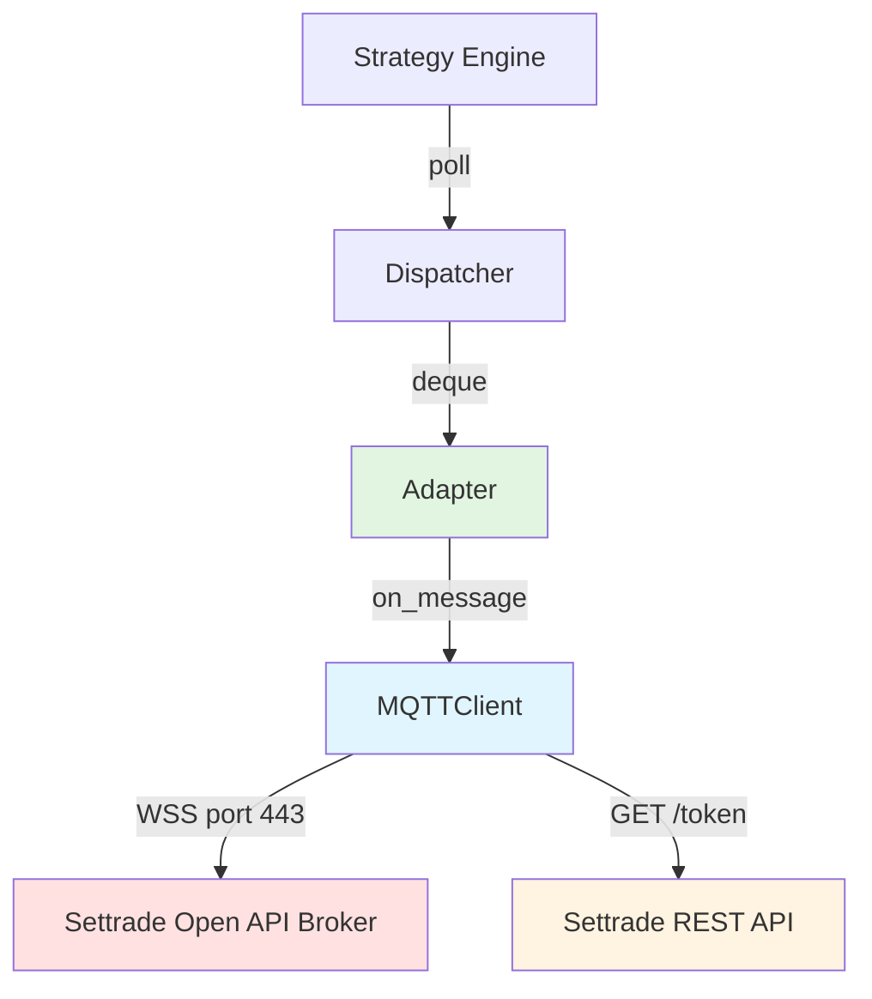
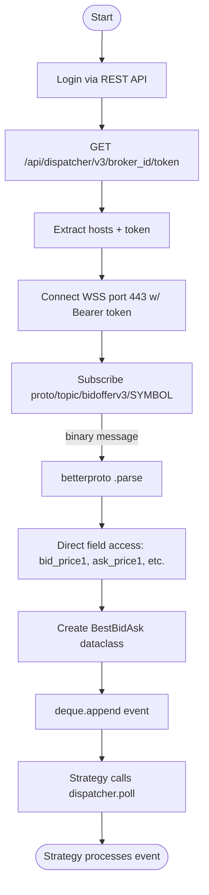
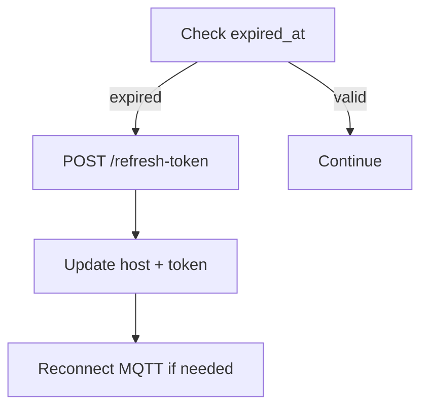
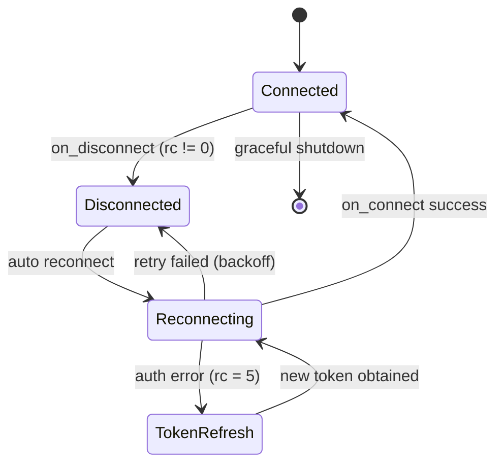

# Settrade MQTT Feed Adapter Implementation Plan

**Feature:** Low-Latency MQTT Feed Adapter for Settrade Open API
**Branch:** `feature/mqtt-feed-adapter`
**Created:** 2026-02-12
**Status:** In Progress (Phase 3 Complete)

---

## Table of Contents

1. [Overview](#overview)
2. [Performance & Reliability Requirements](#performance--reliability-requirements)
3. [Concurrency Model](#concurrency-model)
4. [Runtime Considerations](#runtime-considerations)
5. [Architecture](#architecture)
6. [Service Logic Flow](#service-logic-flow)
7. [Failure Handling Strategy](#failure-handling-strategy)
8. [Implementation Phases](#implementation-phases)
9. [Data Models](#data-models)
10. [Protocol Versioning](#protocol-versioning)
11. [Latency Measurement](#latency-measurement)
12. [Backpressure Strategy](#backpressure-strategy)
13. [Observability](#observability)
14. [Integration Examples](#integration-examples)
15. [Testing Strategy](#testing-strategy)
16. [Success Criteria](#success-criteria)
17. [Future Enhancements](#future-enhancements)
18. [Commit & PR Templates](#commit--pr-templates)

---

## Overview

### Purpose

This feature implements a custom MQTT Feed Adapter that connects directly to the Settrade Open API real-time data MQTT service without using the official Python SDK's realtime client. Instead, it uses low-level MQTT connection over WebSocket, authenticates via host & token fetched through REST, and parses protobuf messages directly for bid/offer updates. This solves performance bottlenecks and enables a low-latency market data feed for trading engines.

### SDK Bottlenecks Identified

Analysis of `settrade_v2.realtime` (the official SDK) reveals these specific overhead sources:

| Bottleneck | SDK Code Path | Impact |
|---|---|---|
| Thread-per-callback | `threading.Thread(target=c, args=args).start()` on every message | GIL contention, ~50-100us overhead per spawn |
| Dict conversion | `schema().parse(msg).to_dict(casing=Casing.SNAKE, include_default_values=True)` | Allocates dict + string keys per message |
| Decimal conversion | `Money.to_dict()` → `Decimal(units) + Decimal(nanos) / 1_000_000_000` | Heap allocation per price field |
| Lock on callback pool | `lock_callback_pool` acquired on every `_get_callback_pool()` | Serializes message dispatch |

This adapter eliminates all four by: no thread spawn, no dict conversion, direct field access, and lock-free hot path.

### Key Objectives

1. **Direct MQTT Connection** – Connect directly to the Settrade Open API MQTT broker via WebSockets with SSL (port 443, Bearer auth header).
2. **Protobuf Parsing** – Parse binary betterproto messages (e.g., BidOfferV3) directly with field access, no `.to_dict()`.
3. **Adapter Abstraction** – Normalize raw messages into clean internal event models (`@dataclass(slots=True)`).
4. **Decoupled Dispatcher** – Publish normalized events into a thread-safe queue for strategy processing.
5. **Low Latency** – Zero thread spawn, zero dict allocation, zero lock contention in the hot path.

### User Benefits

- **High performance** – Direct parse path → lower latency than SDK.
- **Scalability** – Easy to add more topics (price, candlestick, exchange info).
- **Maintains control** – You decide threading/event dispatch model.
- **Modular design** – Can plug into any strategy system.
- **Clean data model** – Normalized dataclasses for easier downstream use.

---

## Performance & Reliability Requirements

### Latency Targets

| Metric | Target | Measurement |
|---|---|---|
| Message receive → normalized event | < 200us | `time.time_ns()` delta |
| Queue push (dispatcher) | < 10us | Benchmark via `deque.append()` |
| End-to-end (broker → strategy poll) | < 500us | Full pipeline benchmark |

### Hot Path Constraints

- **No per-message thread spawn** – Parsing runs inside MQTT callback thread.
- **No dynamic dict allocation** – Direct field access from betterproto → dataclass.
- **No `Decimal` conversion** – Convert `Money(units, nanos)` with integer arithmetic: `units + nanos * 1e-9`.
- **No lock contention** – Queue push is the only synchronization point.
- **Minimal object creation** – Reuse patterns where possible; `slots=True` on all dataclasses.

### Reliability

- Auto reconnect on MQTT disconnect with exponential backoff.
- Token refresh before expiration (track `expired_at` from login response).
- Graceful shutdown: `loop_stop()` + `disconnect()` + drain queue.
- No silent data loss — log and count dropped messages.

---

## Concurrency Model

### Thread Architecture

```
┌─────────────────────────────────────────────────────┐
│  Main Thread                                        │
│  ├─ Setup: create client, adapter, dispatcher       │
│  ├─ Strategy loop: dispatcher.poll() → process      │
│  └─ Shutdown: stop client, drain queue              │
│                                                     │
│  MQTT IO Thread (paho loop_start)                   │
│  ├─ Maintains WebSocket connection                  │
│  ├─ Receives binary messages                        │
│  └─ Calls on_message callback (non-blocking)        │
│                                                     │
│  on_message callback (runs IN MQTT IO thread):      │
│  ├─ Parse protobuf (betterproto .parse())           │
│  ├─ Extract fields → dataclass                      │
│  └─ deque.append(event)  ← only sync point          │
└─────────────────────────────────────────────────────┘
```

### Design Rules

- **MQTT client** runs in a dedicated IO thread via `paho.mqtt.client.loop_start()`.
- **Message callback** must be non-blocking — no I/O, no locks, no thread spawn.
- **Adapter parsing** happens inside the MQTT thread (same thread as `on_message`).
- **Events pushed** into a `collections.deque` (thread-safe for append/popleft in CPython).
- **Strategy consumes** events from the main thread via `dispatcher.poll()`.
- **No locks** inside the hot path except the implicit GIL on `deque.append()`.

### CPython Assumption

> **Important:** This design relies on CPython's GIL guaranteeing atomic `deque.append()` and `deque.popleft()`. This is **not guaranteed** on PyPy, GraalPy, or other alternative interpreters. If migrating away from CPython, replace `deque` with an explicit `threading.Queue` or lock-protected buffer.

### SDK Comparison

| Aspect | Official SDK | This Adapter |
|---|---|---|
| Callback execution | New `threading.Thread` per message | Inline in MQTT thread |
| Message parsing | `.parse(msg).to_dict()` | `.parse(msg)` → direct field access |
| Price conversion | `Decimal` arithmetic → `float` | `units + nanos * 1e-9` |
| Synchronization | `threading.Lock` on callback pool | `deque.append()` only |
| Queue mechanism | None (direct callback) | Bounded `deque` with backpressure |

---

## Runtime Considerations

### Garbage Collection

- All dataclasses use `slots=True` to reduce per-instance memory and avoid `__dict__` allocation.
- Avoid excessive temporary object creation in the hot path — no intermediate dicts, lists, or strings.
- `BestBidAsk` is the only allocation per message (single dataclass, no nested objects).
- **Optional:** Disable cyclic GC during market hours if memory profile allows (`gc.disable()` / `gc.enable()` around trading session). Only if benchmarks show GC pause spikes.
- Monitor `gc.get_count()` in benchmark mode to detect generation-0 pressure.

### Memory Footprint Estimate

| Component | Size | Calculation |
|---|---|---|
| `BestBidAsk` instance | ~80-120 bytes | 8 slots × 8-16 bytes (CPython object overhead) |
| Dispatcher queue (100K) | ~8-12 MB | 100,000 × ~100 bytes |
| MQTT client + buffers | ~1-2 MB | paho-mqtt internal buffers |
| **Total working set** | **~10-15 MB** | Well within typical container limits |

Safe under typical 512MB-1GB container deployment.

### Warm-up Considerations

- First N messages may have higher latency due to:
  - TLS handshake (~50-200ms on first connect)
  - DNS resolution (~10-50ms)
  - CPython bytecode cache warming (first parse path)
- **Benchmark only after stable connection (>10 seconds).**
- Consider a warm-up phase: discard first 100 messages from latency statistics.

---

## Architecture

### Service Components

```
settrade-feed-adapter/
├── infra/
│   ├── settrade_mqtt.py         # Low-level MQTT transport (WebSocket + SSL)
│   ├── settrade_adapter.py      # Adapter per topic (BidOffer, PriceInfo, etc.)
├── core/
│   ├── dispatcher.py            # Bounded deque dispatcher with backpressure
│   ├── events.py                # Internal dataclasses for normalized events
├── examples/
│   ├── example_bidoffer.py      # Example usage
├── requirements.txt
└── README.md
```

### Dependency Graph



### Current System State

**Before implementation (official SDK):**

```
Application
 └─ uses settrade_v2.realtime.RealtimeDataConnection
      ↳ CallBacker._execute_callback() → threading.Thread per message
      ↳ schema().parse(msg).to_dict() → dict allocation per message
      ↳ Money.to_dict() → Decimal arithmetic per price field
      ↳ lock_callback_pool → lock acquired per dispatch
```

### Proposed System State

**After implementation:**

```
Application
 └─ uses settrade-feed-adapter
      ↳ direct MQTT connection (same paho-mqtt, no SDK wrapper)
      ↳ betterproto .parse() → direct field access (no .to_dict())
      ↳ units + nanos * 1e-9 (no Decimal)
      ↳ deque.append() → lock-free hot path
      ↳ dispatcher.poll() → strategy consumes
```

---

## Service Logic Flow

### Main Flow Diagram



### Token Refresh Flow



---

## Failure Handling Strategy

### Error Categories & Policies

| Error Type | Detection | Action | Recovery |
|---|---|---|---|
| MQTT disconnect | `on_disconnect` callback with `rc != 0` | Log + auto reconnect | Exponential backoff: 1s, 2s, 4s, 8s, max 30s |
| Protobuf parse error | `except` in `on_message` | Log error + drop message | Increment `parse_error_count` counter |
| Token expiration | `time.time() >= expired_at` | Refresh token via REST | Re-authenticate + reconnect MQTT |
| REST API failure | HTTP error on token fetch | Log + retry with backoff | Max 5 retries, then raise |
| Queue overflow | `len(deque) >= maxlen` | Drop oldest message | Increment `drop_count` counter + log warning |
| Subscription rejected | `$sys/u/_broker/_uref/error/subscribe` topic | Log error message | Surface error to caller |

### Reconnection State Machine



### Graceful Shutdown Sequence

1. Unsubscribe from all topics
2. `client.loop_stop()` — stop MQTT IO thread
3. `client.disconnect()` — clean MQTT disconnect
4. Drain remaining events from dispatcher queue
5. Log final statistics (messages processed, errors, drops)

---

## Implementation Phases

### Phase 0: Planning & Scaffolding

**Tasks:**
- Create branch: `feature/mqtt-feed-adapter`
- Add `docs/plan/low-latency-mqtt-feed-adapter/PLAN.md`
- Setup Python project structure with `pyproject.toml`
- Install required dependencies (`paho-mqtt`, `settrade-v2`)

---

### Phase 1: MQTT Transport — Complete (2026-02-12)

**Branch:** `feature/phase1-mqtt-transport`
**Plan:** `docs/plan/low-latency-mqtt-feed-adapter/phase1-mqtt-transport.md`

**Deliverables:**

- `infra/settrade_mqtt.py` — `SettradeMQTTClient` with WSS+TLS, token auth, auto-reconnect, token refresh
- `infra/__init__.py` — Package exports
- `tests/test_settrade_mqtt.py` — 53 unit tests, all passing
- `scripts/test_mqtt_connection.py` — Integration smoke test (verified against sandbox)
- `.env.sample` — Credential template for public repo

**Key design decisions:**

- Synchronous paho-mqtt threading for <200us latency (justified deviation from async-first)
- SDK `Context` + `dispatch(Option(...))` for authentication with auto-refresh
- Controlled reconnect for token refresh (no live WSS header mutation)
- Client generation ID to reject stale callbacks
- State guard (`_reconnecting` flag) prevents duplicate reconnect threads
- Exponential backoff with jitter (±20%), infinite retry, bounded max 30s
- `clean_session=True` — at-most-once delivery, freshness over reliability

**Issues encountered:**

1. SDK API mismatch: `Context.request()` takes full URL, not path — resolved with `Option` + `dispatch()` pattern
2. SANDBOX detection: SDK maps `broker_id="SANDBOX"` → `"098"`, env → `"uat"` — replicated in `_login()`

---

### Phase 2: Adapter for BidOffer — Complete (2026-02-13)

**Branch:** `feature/phase2-bidoffer-adapter`
**Plan:** `docs/plan/low-latency-mqtt-feed-adapter/phase2-bidoffer-adapter.md`

**Deliverables:**

- `core/events.py` — Pydantic event models: `BestBidAsk`, `FullBidOffer`, `BidAskFlag(IntEnum)`
- `core/__init__.py` — Core package with public exports
- `infra/settrade_adapter.py` — `BidOfferAdapter` with protobuf parsing, dual event modes, rate-limited logging
- `infra/__init__.py` — Updated package exports
- `tests/test_events.py` — 32 unit tests for event models (immutability, validation, model_construct bypass, deep immutability, hashability)
- `tests/test_settrade_adapter.py` — 41 unit tests for adapter (parsing, error isolation, rate-limited logging, stats, end-to-end)

**Key design decisions:**

- Pydantic `BaseModel(frozen=True)` with `model_construct()` in hot path (project standard compliance, zero validation overhead)
- Separated error isolation: `parse_errors` vs `callback_errors` in distinct try/except blocks
- Lock-free hot-path counters (GIL-atomic `+= 1`), lock only in `stats()` for consistent reads
- Dual timestamps: `time.time_ns()` (wall clock) + `time.perf_counter_ns()` (monotonic)
- Explicit field unroll for FullBidOffer (no `getattr`/f-string in hot path)
- Callback-based event forwarding (decoupled from Phase 3 dispatcher)
- Rate-limited logging: first N errors with exception trace, then every Nth
- `_sub_lock` protects `_subscribed_symbols` set for thread-safe stats reads
- Float precision contract: downstream must use tolerance comparison, not equality
- Protobuf instance reuse deferred (documented as future optimization)

**Issues encountered:**

1. PLAN.md specified `@dataclass(slots=True)` but project standard requires Pydantic — resolved with `model_construct()` for hot-path performance
2. `logging.exception()` in hot path would spam logs at high error rates — implemented rate-limited logging immediately rather than deferring to Phase 5

---

### Phase 3: Dispatcher & Event Queue — Complete (2026-02-13)

**Branch:** `feature/phase3-dispatcher`
**Plan:** `docs/plan/low-latency-mqtt-feed-adapter/phase3-dispatcher.md`

**Deliverables:**

- `core/dispatcher.py` — `Dispatcher[T]` (generic), `DispatcherConfig`, `DispatcherStats` with push/poll/clear/stats
- `core/__init__.py` — Updated package exports
- `tests/test_dispatcher.py` — 51 unit tests, all passing, 100% coverage

**Key design decisions:**

- `collections.deque(maxlen=100_000)` for automatic drop-oldest backpressure
- Pre-check drop detection (`len() == maxlen` before `append()`) leveraging deque(maxlen) eviction guarantee
- Lock-free stats — no `_counter_lock` since each counter is single-writer and CPython int reads are atomic
- Optimised poll loop — bounded `for` with truthiness break (no exception control flow, no `len(events)` per iteration)
- Generic `Dispatcher[T]` with `TypeVar` for type-safe usage at adapter and strategy layers
- `clear()` method for MQTT reconnection, trading halts, and error recovery
- `_invariant_ok()` for test-time consistency verification: `total_pushed - total_dropped - total_polled == queue_len`
- Eventually-consistent stats (not transactional) — documented explicitly
- Strictly SPSC (single-producer, single-consumer) — documented as non-negotiable constraint

**Issues encountered:**

1. Drop detection race: initial post-append `prev_len` check had potential overcount under SPSC. Switched to pre-check pattern.
2. Stats lock removal: `_counter_lock` only prevented two `stats()` calls from colliding — removed entirely since counters are single-writer.
3. Poll loop optimisation: replaced `while` with `len(events)` per-iteration check with bounded `for` loop.

---

### Phase 4: Examples & Scripts

**Tasks:**
- Add example script for bid/offer subscription in `examples/example_bidoffer.py`
- Add latency measurement example
- Provide readme usage examples

---

### Phase 5: Documentation

**Tasks:**
- Write `README.md` integration examples
- Add architecture diagram
- Provide troubleshooting section
- Document performance benchmarks vs SDK

---

## Data Models

### BestBidAsk (Normalized Event)

```python
@dataclass(slots=True)
class BestBidAsk:
    symbol: str
    bid: float          # Best bid price (bid_price1)
    ask: float          # Best ask price (ask_price1)
    bid_vol: int        # Best bid volume (bid_volume1)
    ask_vol: int        # Best ask volume (ask_volume1)
    bid_flag: int       # 1=NORMAL, 2=ATO, 3=ATC
    ask_flag: int       # 1=NORMAL, 2=ATO, 3=ATC
    recv_ts: int        # time.time_ns() at receive
```

### Full BidOffer (Extended Event — Optional)

```python
@dataclass(slots=True)
class FullBidOffer:
    symbol: str
    bid_prices: tuple[float, ...]    # Top 10 bid prices
    ask_prices: tuple[float, ...]    # Top 10 ask prices
    bid_volumes: tuple[int, ...]     # Top 10 bid volumes
    ask_volumes: tuple[int, ...]     # Top 10 ask volumes
    bid_flag: int
    ask_flag: int
    recv_ts: int
```

### Money Conversion (Hot Path)

```python
# SDK approach (slow):
# Decimal(units) + Decimal(nanos) / Decimal("1_000_000_000") → float

# Our approach (fast):
def money_to_float(money) -> float:
    return money.units + money.nanos * 1e-9
```

---

## Protocol Versioning

### Current Support

| Protocol | Topic Pattern | Protobuf Module |
|---|---|---|
| BidOfferV3 | `proto/topic/bidofferv3/<symbol>` | `settrade_v2.pb.bidofferv3_pb2` |

### Available for Future Implementation

| Protocol | Topic Pattern | Protobuf Module |
|---|---|---|
| InfoV3 | `proto/topic/infov3/<symbol>` | `settrade_v2.pb.infov3_pb2` |
| CandlestickV3 | `proto/topic/cdlv3/<symbol>/<interval>` | `settrade_v2.pb.candlestickv3_pb2` |
| EquityExchangeInfoV3 | `proto/topic/exchinfoeqv3/<market>` | `settrade_v2.pb.exchinfoeqv3_pb2` |
| DerivExchangeInfoV3 | `proto/topic/exchinfodvv3/<market>` | `settrade_v2.pb.exchinfodvv3_pb2` |
| OrderEquityV3 | `proto/ua/_broker/<acct>/_front/ordereqv3` | `settrade_v2.pb.ordereqv3_pb2` |
| OrderDerivV3 | `proto/ua/_broker/<acct>/_front/orderdvv3` | `settrade_v2.pb.orderdvv3_pb2` |

### Versioning Strategy

- Version upgrades (e.g., V3 → V4) are **isolated inside the adapter layer**.
- Each adapter class owns its protobuf schema and topic pattern.
- Adding a new version = new adapter class, no change to dispatcher or strategy.
- Backward compatibility: old adapters continue working until explicitly removed.

---

## Latency Measurement

### Measurement Points

```
[Broker sends message]
        │
        ▼
   ┌─ on_message callback ─── t0 = time.time_ns()
   │   Parse protobuf
   │   Normalize → dataclass
   │   deque.append()          ─── t1 = time.time_ns()
   └─────────────────────────
        │
        ▼
   ┌─ dispatcher.poll()        ─── t2 = time.time_ns()
   │   Strategy processes
   └─────────────────────────
```

### Metrics Collected

| Metric | Calculation | Target |
|---|---|---|
| Parse + normalize latency | `t1 - t0` | < 200us |
| Queue wait time | `t2 - t1` | Depends on poll frequency |
| End-to-end latency | `t2 - t0` | < 500us |

### Reporting

- `recv_ts` captured via `time.time_ns()` on every event.
- Optional latency logger: compute P50, P95, P99 percentiles over sliding window.
- Benchmark mode: compare with SDK by running both in parallel on same symbol.
- Counters: `messages_received`, `parse_errors`, `events_dispatched`, `events_dropped`.

---

## Backpressure Strategy

### Dispatcher Queue Design

```python
class Dispatcher:
    def __init__(self, maxlen: int = 100_000):
        self._queue: deque[Any] = deque(maxlen=maxlen)
        self._total_pushed: int = 0
        self._total_dropped: int = 0
```

### Overflow Policy: Drop-Oldest

- `collections.deque(maxlen=100_000)` automatically drops the oldest item when full.
- This is the correct policy for market data: **stale data is worthless**.
- Every drop increments `_total_dropped` counter.
- Log warning when drop rate exceeds threshold (e.g., >1% of messages).

### Queue Sizing Rationale

| Parameter | Value | Rationale |
|---|---|---|
| Default maxlen | 100,000 | ~10 seconds at 10K msg/s |
| Typical message rate | 100-1,000 msg/s per symbol | Settrade market hours |
| Poll batch size | 100 events per `poll()` call | Balance latency vs overhead |

### Monitoring

- `dispatcher.stats()` returns `(total_pushed, total_polled, total_dropped, queue_len)`.
- Strategy can check drop rate and adjust processing speed or alert.

---

## Observability

### Metrics Exposed

| Metric | Type | Description |
|---|---|---|
| `messages_received` | Counter | Total MQTT messages received |
| `events_dispatched` | Counter | Events successfully pushed to queue |
| `events_dropped` | Counter | Events dropped due to queue overflow |
| `parse_errors` | Counter | Protobuf parse failures |
| `reconnect_count` | Counter | Number of MQTT reconnections |
| `queue_depth` | Gauge | Current items in dispatcher queue |
| `parse_latency_ns` | Histogram | Parse + normalize duration per message |

### Access Pattern

```python
# Built-in stats
stats = dispatcher.stats()
# → (total_pushed=150432, total_polled=150430, total_dropped=0, queue_len=2)

client_stats = mqtt_client.stats()
# → (messages_received=150432, parse_errors=0, reconnect_count=0)
```

### Optional Integrations

- **Structured JSON logging** — Default. Log stats at configurable interval (e.g., every 60s).
- **Prometheus** — Expose `/metrics` endpoint via `prometheus_client` if installed.
- **StatsD** — Push metrics to StatsD/Datadog agent if configured.

These are opt-in; the core adapter has zero external observability dependencies.

---

## Integration Examples

### Example Usage

```python
from infra.settrade_mqtt import SettradeMQTTClient
from infra.settrade_adapter import BidOfferAdapter
from core.dispatcher import Dispatcher

# Setup
mqtt_client = SettradeMQTTClient(
    app_id="your_app_id",
    app_secret="your_app_secret",
    broker_id="your_broker_id",
)
mqtt_client.connect()

dispatcher = Dispatcher(maxlen=100_000)
adapter = BidOfferAdapter(mqtt_client, dispatcher)
adapter.subscribe("AOT")

# Strategy loop
try:
    while True:
        for event in dispatcher.poll():
            print(f"{event.symbol} bid={event.bid} ask={event.ask}")
except KeyboardInterrupt:
    mqtt_client.shutdown()
```

### Latency Measurement Example

```python
import time
from core.dispatcher import Dispatcher

# Inside strategy loop
for event in dispatcher.poll():
    now = time.time_ns()
    latency_us = (now - event.recv_ts) / 1_000
    print(f"{event.symbol} latency={latency_us:.0f}us")
```

---

## Testing Strategy

### Unit Tests

- Test protobuf parsing: feed raw binary → verify parsed fields.
- Test `money_to_float()`: verify `Money(units=25, nanos=500_000_000)` → `25.5`.
- Test adapter normalization: mock betterproto message → verify `BestBidAsk` fields.
- Test dispatcher: push N events → poll → verify order and count.
- Test backpressure: push beyond maxlen → verify oldest dropped.

### Integration Tests

- Connect to sandbox broker with real credentials.
- Subscribe to sample symbols (e.g., AOT, PTT).
- Validate continuous event flow for 60 seconds.
- Verify auto-reconnect by simulating disconnect.

### Performance Tests

- Benchmark parse + normalize latency over 10,000 messages.
- Compare with SDK: run both paths on same symbol, log P50/P99.
- Stress test dispatcher with 100K events.
- Monitor GC pauses via `gc.get_count()` during sustained load.

---

## Success Criteria

- Adapter connects to Settrade broker successfully via WSS.
- Events parsed & normalized correctly (field values match SDK output).
- No dict conversion, no thread spawn, no Decimal in hot path.
- Parse + normalize latency < 200us (P99).
- Dispatcher queue accessible for strategy consumption.
- Auto-reconnect recovers within 30 seconds.
- Token refresh works before expiration.
- Example scripts work in sandbox environment.
- Latency benchmarks documented and compared with SDK.
- Observability stats accessible via `dispatcher.stats()` and `mqtt_client.stats()`.

---

## Future Enhancements

### Short-term

- Multi-symbol batch subscription (subscribe to N symbols in one call).
- PriceInfo adapter (`InfoV3` protobuf, `proto/topic/infov3/<symbol>`).
- Candlestick adapter (`CandlestickV3`, `proto/topic/cdlv3/<symbol>/<interval>`).
- Exchange info adapter (market status events).

### Medium-term

- `asyncio` implementation — replace threading with `asyncio` event loop + `aiomqtt`.
- Zero-copy ring buffer — replace `deque` with `mmap`-backed ring buffer.
- Shared memory transport — publish events via shared memory for multi-process strategies.

### Long-term

- Rust extension for protobuf parsing — `pyo3` + `prost` for sub-microsecond parse.
- FPGA offload for network + parse path (research).
- Multi-broker aggregation — connect to multiple brokers simultaneously.

---

## Commit & PR Templates

### Commit Template

```
feat(adapter): add mqtt feed adapter for bid/offer
```

### PR Template

```markdown
## Summary
Add direct MQTT feed adapter for Settrade Open API

## Changes
- Add SettradeMQTTClient (direct WSS + token auth)
- Add BidOfferAdapter (betterproto parse → dataclass)
- Add Dispatcher (bounded deque with backpressure)
- Add normalized event models (BestBidAsk, FullBidOffer)

## Performance
- No thread-per-message (inline parse in MQTT thread)
- No dict conversion (direct field access)
- No Decimal (integer arithmetic for Money)
- Target: < 200us parse latency (P99)

## Testing
- Unit tests for parse, normalize, dispatcher
- Manual sandbox verified
- Latency benchmarks vs SDK
```

---
